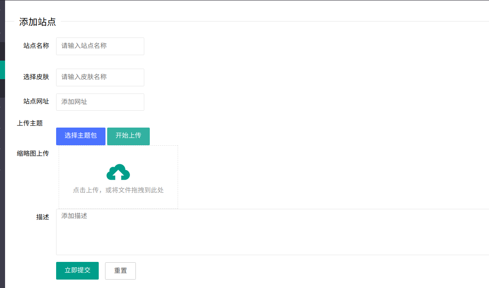

# cms-admin模块开发手册
---
## 目录
  * [内容管理](README.md#内容管理)
    * [文章管理](README.md#文章管理)
    * [栏目管理](README.md#栏目管理)
    * [文件管理](README.md#文件管理)
    * [外链管理](README.md#外链管理)
  * [权限管理](README.md#权限管理)
    * [用户管理](README.md#用户管理)
    * [网站管理](README.md#网站管理)
    * [定时任务](README.md#定时任务)
  * [系统设置](README.md#系统设置)
    * [存储设置](README.md#存储设置)
    * [皮肤管理](README.md#皮肤管理)
  * [统计信息](README.md#统计信息)
    * [总览](README.md#总览设置)
    * [日志](README.md#日志设置)
  * [运营](README.md#运营)
    * [问卷管理](README.md#问卷管理)
  * [邮件管理](README.md#邮件管理)
 
#### 主页面

# 内容管理
## 文章管理
   ### 页面:
   
  添加文章时需要注意:
   1. 皮肤只能自己选择，没有提示
   2. 文章标签分隔符为,
   3.上传文件需要点击开始上传按钮
## 栏目管理
   ### 页面:
   
   * 待审核文章,栏目
     #### 页面:
     
      注意: 在添加更新文章栏目时，没有通过审核或者未审核的栏目，是不显示的
## 文件管理
   ### 页面:
   
##    外链管理
   ### 页面:
   
# 权限管理
## 用户管理
   ### 页面:
   
   * 用户所含有的权限
   #### 页面:
   
## 网站管理
   ### 页面:
   
   注意: 添加网站时，可以上传自己的皮肤
## 定时任务
   ### 页面:
       
      
# 系统设置
## 存储设置
## 皮肤管理

   * 皮肤上传的格式
   
    分成两个文件夹templates和static，最后打成zip包，zip包名就是皮肤名字
        └─skinName
            ├─static
            └─templates
# 统计信息
## 总览设置
## 日志
# 邮件管理
   已读邮件支持快捷回复功能     
